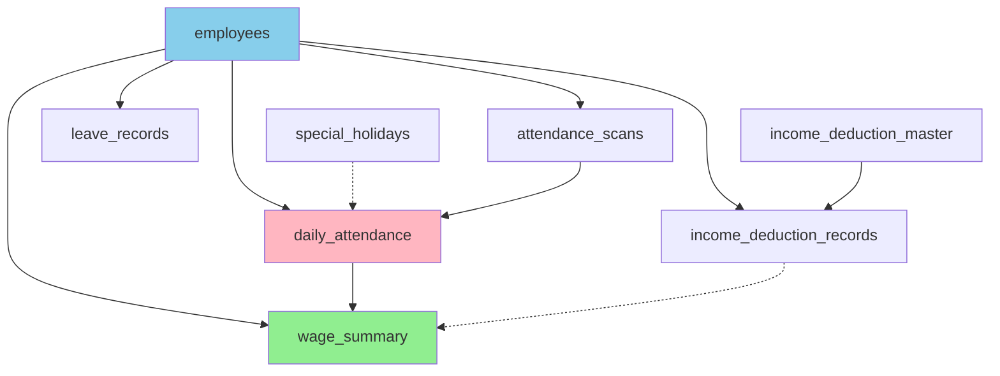

# 🗄️ Database Tables Reference - ระบบคำนวณค่าจ้าง

## 📋 สารบัญ Tables

### 🔵 Core Tables (จำเป็น)
1. [employees](#1-employees) - ข้อมูลพนักงาน
2. [attendance_scans](#2-attendance_scans) - ข้อมูล scan เข้า-ออกดิบ
3. [daily_attendance](#3-daily_attendance) - สรุป OT รายวัน
4. [wage_summary](#4-wage_summary) - ⭐ สรุปค่าจ้างรายงวด (ใหม่!)

### 🟢 Supporting Tables (รองรับ)
5. [special_holidays](#5-special_holidays) - วันหยุดพิเศษ
6. [leave_records](#6-leave_records) - บันทึกการลา
7. [income_deduction_master](#7-income_deduction_master) - รายการเงินได้/หัก
8. [income_deduction_records](#8-income_deduction_records) - เงินได้/หักจริง

---

## 📊 ความสัมพันธ์ระหว่าง Tables



---

## 1. employees

**ตาราง:** `employees`  
**คำอธิบาย:** เก็บข้อมูลพนักงานและอัตราค่าจ้าง

### Schema:
```sql
CREATE TABLE employees (
    id SERIAL PRIMARY KEY,
    employee_id VARCHAR(20) UNIQUE NOT NULL,
    name VARCHAR(255) NOT NULL,
    department VARCHAR(100) NOT NULL,
    perday_salary DECIMAL(10,2),     -- ค่าจ้างรายวัน
    perhr_salary DECIMAL(10,2),      -- ค่าจ้างต่อชั่วโมง
    bank_id INTEGER,
    bank_account INTEGER,
    identity_id VARCHAR(20),         -- เลขบัตรประชาชน
    line_id TEXT,                    -- LINE User ID
    created_at TIMESTAMP WITH TIME ZONE DEFAULT NOW(),
    updated_at TIMESTAMP WITH TIME ZONE DEFAULT NOW()
);
```

### Fields สำคัญสำหรับคำนวณค่าจ้าง:
| Field | Type | ใช้ในการคำนวณ | หมายเหตุ |
|-------|------|----------------|----------|
| `employee_id` | VARCHAR(20) | ✅ PK | รหัสพนักงาน |
| `perday_salary` | DECIMAL(10,2) | ✅ | ค่าจ้างรายวัน (ไม่ได้ใช้ในระบบปัจจุบัน) |
| `perhr_salary` | DECIMAL(10,2) | ✅✅✅ | **หัวใจ!** ใช้คำนวณค่าจ้างและ OT ทั้งหมด |

### ตัวอย่างข้อมูล:
```sql
INSERT INTO employees VALUES
('20051185', 'นางบัวผัน เพ่งสว่าง', 'หัวหน้าแผนก', 560.00, 70.00, ...);
```

### การคำนวณค่าจ้าง:
```typescript
// Base Wage
base_wage = actual_hours × perhr_salary

// OT Wages
ot_normal_wage = ot_normal_hours × perhr_salary × 1.5
ot_special_wage = ot_special_hours × perhr_salary × 2.0
ot_premium_wage = ot_premium_hours × perhr_salary × 3.0
```

---

## 2. attendance_scans

**ตาราง:** `attendance_scans`  
**คำอธิบาย:** เก็บข้อมูลการสแกนใบหน้าเข้า-ออกดิบจากเครื่อง

### Schema:
```sql
CREATE TABLE attendance_scans (
    id SERIAL PRIMARY KEY,
    machine_id VARCHAR(10) NOT NULL,
    scan_date DATE NOT NULL,
    scan_time TIME NOT NULL,
    employee_id VARCHAR(20) NOT NULL,
    scan_type INTEGER NOT NULL CHECK (scan_type IN (1, 2)),  -- 1=IN, 2=OUT
    created_at TIMESTAMP WITH TIME ZONE DEFAULT NOW(),
    CONSTRAINT fk_employee FOREIGN KEY (employee_id) REFERENCES employees(employee_id)
);
```

### Fields:
| Field | Type | คำอธิบาย |
|-------|------|----------|
| `scan_date` | DATE | วันที่สแกน |
| `scan_time` | TIME | เวลาที่สแกน |
| `scan_type` | INTEGER | 1 = เข้างาน, 2 = ออกงาน |

### ตัวอย่างข้อมูล:
```
machine_id | scan_date  | scan_time | employee_id | scan_type
-----------|------------|-----------|-------------|----------
1          | 2025-11-01 | 08:00:00  | 20051185    | 1 (IN)
1          | 2025-11-01 | 18:30:00  | 20051185    | 2 (OUT)
```

### บทบาทในการคำนวณ:
- **Input:** ข้อมูลดิบจากไฟล์ .txt
- **Output:** ถูกประมวลผลเป็น → `daily_attendance`
- **ไม่ใช้โดยตรง** ในการคำนวณค่าจ้าง

---

## 3. daily_attendance

**ตาราง:** `daily_attendance`  
**คำอธิบาย:** ⭐ สรุปการทำงานและ OT รายวัน (คำนวณจาก attendance_scans แล้ว)

### Schema:
```sql
CREATE TABLE daily_attendance (
    id SERIAL PRIMARY KEY,
    employee_id VARCHAR(20) NOT NULL,
    work_date DATE NOT NULL,
    check_in_time TIME,
    check_out_time TIME,
    scheduled_in_time TIME,
    scheduled_out_time TIME,
    actual_hours DECIMAL(5,2) DEFAULT 0,        -- ชั่วโมงทำงานจริง
    ot_hours DECIMAL(5,2) DEFAULT 0,            -- OT รวม
    ot_normal_hours DECIMAL(5,2) DEFAULT 0,     -- OT ×1.5
    ot_special_hours DECIMAL(5,2) DEFAULT 0,    -- OT ×2
    ot_premium_hours DECIMAL(5,2) DEFAULT 0,    -- OT ×3
    is_holiday BOOLEAN DEFAULT FALSE,
    is_leave BOOLEAN DEFAULT FALSE,
    late BOOLEAN DEFAULT FALSE,
    late_hours DECIMAL(5,2) DEFAULT 0,
    notes TEXT,
    created_at TIMESTAMP WITH TIME ZONE DEFAULT NOW(),
    updated_at TIMESTAMP WITH TIME ZONE DEFAULT NOW(),
    CONSTRAINT fk_daily_employee FOREIGN KEY (employee_id) REFERENCES employees(employee_id),
    UNIQUE(employee_id, work_date)
);
```

### Fields สำหรับคำนวณค่าจ้าง:
| Field | Type | ใช้คำนวณ | หมายเหตุ |
|-------|------|----------|----------|
| `actual_hours` | DECIMAL(5,2) | ✅ | ชั่วโมงทำงานจริง (ปกติ 8 ชม.) |
| `ot_normal_hours` | DECIMAL(5,2) | ✅ | OT ปกติ (×1.5) |
| `ot_special_hours` | DECIMAL(5,2) | ✅ | OT พิเศษ (×2) - 8 ชม.แรกในวันหยุด |
| `ot_premium_hours` | DECIMAL(5,2) | ✅ | OT ขั้นสูง (×3) - เกิน 8 ชม.ในวันหยุด |
| `is_leave` | BOOLEAN | ✅ | ใช้ตรวจสอบเบี้ยขยัน |
| `late` | BOOLEAN | ✅ | ใช้ตรวจสอบเบี้ยขยัน |

### ตัวอย่างข้อมูล:
```
work_date  | actual_hours | ot_normal | ot_special | ot_premium | late
-----------|--------------|-----------|------------|------------|-----
2025-11-01 | 8.00         | 1.50      | 0.00       | 0.00       | false
2025-11-03 | 8.00         | 0.00      | 8.00       | 2.00       | false (วันหยุด)
```

### บทบาทในการคำนวณ:
- **Input หลัก** สำหรับคำนวณค่าจ้าง
- ถูก query โดย `/api/wages/calculate`
- คำนวณเป็น daily wage → period wage → wage_summary

---

## 4. wage_summary

**ตาราง:** `wage_summary` ⭐ **ใหม่!**  
**คำอธิบาย:** สรุปค่าจ้างที่คำนวณแล้วรายงวด (Period)

### Schema:
```sql
CREATE TABLE wage_summary (
    id SERIAL PRIMARY KEY,
    employee_id VARCHAR(20) NOT NULL,
    year INTEGER NOT NULL,
    month INTEGER NOT NULL,
    period INTEGER NOT NULL CHECK (period IN (1, 2)),  -- 1 or 2
    base_wage DECIMAL(10,2) DEFAULT 0,                 -- ค่าจ้างพื้นฐาน
    ot_wage DECIMAL(10,2) DEFAULT 0,                   -- ค่า OT รวม
    attendance_bonus DECIMAL(10,2) DEFAULT 0,          -- เบี้ยขยัน
    total_income DECIMAL(10,2) DEFAULT 0,              -- รายได้รวม
    sso DECIMAL(10,2) DEFAULT 0,                       -- ประกันสังคม
    tax DECIMAL(10,2) DEFAULT 0,                       -- ภาษีหัก ณ ที่จ่าย
    total_deduction DECIMAL(10,2) DEFAULT 0,           -- รวมหัก
    net_wage DECIMAL(10,2) DEFAULT 0,                  -- เงินสุทธิ
    created_at TIMESTAMP WITH TIME ZONE DEFAULT NOW(),
    updated_at TIMESTAMP WITH TIME ZONE DEFAULT NOW(),
    CONSTRAINT fk_wage_employee FOREIGN KEY (employee_id) 
        REFERENCES employees(employee_id) ON DELETE CASCADE,
    UNIQUE(employee_id, year, month, period)
);

CREATE INDEX idx_wage_summary_employee_year ON wage_summary(employee_id, year);
CREATE INDEX idx_wage_summary_year_month ON wage_summary(year, month, period);
```

### Fields ทั้งหมด:
| Field | Type | คำนวณจาก | คำอธิบาย |
|-------|------|----------|----------|
| `year` | INTEGER | - | ปี (2025) |
| `month` | INTEGER | - | เดือน (1-12) |
| `period` | INTEGER | - | งวด (1 หรือ 2) |
| `base_wage` | DECIMAL | `daily_attendance` | ค่าจ้างพื้นฐาน + OT |
| `ot_wage` | DECIMAL | `daily_attendance` | ค่า OT ทั้งหมด |
| `attendance_bonus` | DECIMAL | `daily_attendance` | เบี้ยขยัน 500฿ |
| `total_income` | DECIMAL | SUM ด้านบน | base + ot + bonus |
| `sso` | DECIMAL | คำนวณรายเดือน | ประกันสังคม 5% (แบ่ง 2 งวด) |
| `tax` | DECIMAL | Cumulative YTD | ภาษีหัก ณ ที่จ่าย |
| `total_deduction` | DECIMAL | sso + tax | รวมหัก |
| `net_wage` | DECIMAL | income - deduction | เงินสุทธิ |

### ตัวอย่างข้อมูล:
```sql
employee_id | year | month | period | base_wage | ot_wage | bonus | total_income | sso   | tax  | net_wage
------------|------|-------|--------|-----------|---------|-------|--------------|-------|------|----------
20051185    | 2025 | 11    | 1      | 9029.12   | 3315.38 | 0.00  | 12344.50     | 617.23| 131  | 11596.27
20051185    | 2025 | 11    | 2      | 4523.00   | 1103.82 | 500   | 6126.82      | 131.39| 68   | 5927.43
```

### การคำนวณแต่ละ Field:

#### 1. base_wage (ค่าจ้างพื้นฐาน)
```typescript
base_wage = SUM(daily_attendance.actual_hours × perhr_salary)
          + SUM(ot_normal_hours × perhr_salary × 1.5)
          + SUM(ot_special_hours × perhr_salary × 2.0)
          + SUM(ot_premium_hours × perhr_salary × 3.0)
```

#### 2. ot_wage (ค่า OT รวม)
```typescript
ot_wage = SUM(ot_normal_hours × perhr_salary × 1.5)
        + SUM(ot_special_hours × perhr_salary × 2.0)
        + SUM(ot_premium_hours × perhr_salary × 3.0)
```

#### 3. attendance_bonus (เบี้ยขยัน)
```typescript
attendance_bonus = 500  // ถ้าไม่ลางาน และ ไม่มาสาย
attendance_bonus = 0    // ถ้ามีการลา หรือ มาสาย
```

#### 4. total_income (รายได้รวม)
```typescript
total_income = base_wage + attendance_bonus
```

#### 5. sso (ประกันสังคม)
```typescript
// คำนวณรายเดือน (ทั้ง 2 งวดรวมกัน)
monthly_income = period1_income + period2_income
sso_base = MIN(monthly_income, 15000)  // เพดาน 15,000
monthly_sso = sso_base × 0.05           // อัตรา 5%

// แบ่งตามสัดส่วน
if (period1_income >= period2_income) {
  period1_sso = monthly_sso
  period2_sso = 0
} else {
  period1_sso = monthly_sso × (period1_income / monthly_income)
  period2_sso = monthly_sso - period1_sso
}
```

#### 6. tax (ภาษีหัก ณ ที่จ่าย)
```typescript
// Cumulative Year-to-Date Method
1. ประมาณการรายได้ทั้งปี = YTD + งวดนี้ + (งวดนี้ × งวดที่เหลือ)
2. หักค่าใช้จ่าย = MIN(รายได้ทั้งปี × 50%, 100,000)
3. หักค่าลดหย่อน = 60,000 + (30,000 × จำนวนบุตร)
4. เงินได้สุทธิ = รายได้ - ค่าใช้จ่าย - ค่าลดหย่อน
5. ภาษีทั้งปี = คำนวณตามขั้นบันได
6. ภาษีงวดนี้ = (ภาษีทั้งปี - ภาษี YTD) / งวดที่เหลือ
```

#### 7. total_deduction & net_wage
```typescript
total_deduction = sso + tax
net_wage = total_income - total_deduction
```

### บทบาทสำคัญ:
- ✅ **Output หลัก** ของระบบคำนวณค่าจ้าง
- ✅ ใช้แสดงในหน้า `/wages/[id]`
- ✅ ใช้แสดงใน LIFF `/liff/employee-ot-viewer`
- ✅ ใช้คำนวณ YTD และ All-Time summary
- ✅ Upsert อัตโนมัติหลัง import scan

---

## 5. special_holidays

**ตาราง:** `special_holidays`  
**คำอธิบาย:** วันหยุดพิเศษ (วันหยุดราชการ, วันหยุดบริษัท)

### Schema:
```sql
CREATE TABLE special_holidays (
    id SERIAL PRIMARY KEY,
    holiday_date DATE NOT NULL,
    holiday_name VARCHAR(100) NOT NULL,
    is_national BOOLEAN DEFAULT TRUE,
    description TEXT,
    created_at TIMESTAMP WITH TIME ZONE DEFAULT NOW(),
    updated_at TIMESTAMP WITH TIME ZONE DEFAULT NOW(),
    UNIQUE(holiday_date)
);
```

### บทบาทในการคำนวณ:
- ใช้ตรวจสอบว่าวันไหนเป็นวันหยุด
- OT ในวันหยุด = ×2 (8 ชม.แรก), ×3 (เกิน 8 ชม.)
- Query โดย `calculateOTFromScans()` ใน `/lib/otCalculator.ts`

### ตัวอย่างข้อมูล:
```sql
INSERT INTO special_holidays VALUES
('2025-01-01', 'วันขึ้นปีใหม่', true),
('2025-04-13', 'วันสงกรานต์', true),
('2025-05-01', 'วันแรงงาน', true);
```

---

## 6. leave_records

**ตาราง:** `leave_records`  
**คำอธิบาย:** บันทึกการลางาน

### Schema:
```sql
CREATE TABLE leave_records (
    id SERIAL PRIMARY KEY,
    employee_id VARCHAR(20) NOT NULL,
    leave_date DATE NOT NULL,
    leave_type VARCHAR(50) DEFAULT 'Personal',
    reason TEXT,
    leave_able BOOLEAN DEFAULT FALSE,
    rejected_reason TEXT,
    created_by VARCHAR(100),
    created_at TIMESTAMP WITH TIME ZONE DEFAULT NOW(),
    updated_at TIMESTAMP WITH TIME ZONE DEFAULT NOW(),
    CONSTRAINT fk_leave_employee FOREIGN KEY (employee_id) REFERENCES employees(employee_id),
    UNIQUE(employee_id, leave_date)
);
```

### บทบาทในการคำนวณ:
- ใช้ตรวจสอบเบี้ยขยัน (ถ้าลา = ไม่ได้เบี้ยขยัน)
- ไม่ได้ query โดยตรงในการคำนวณค่าจ้าง
- แต่ affect `daily_attendance.is_leave` ซึ่ง affect เบี้ยขยัน

---

## 7. income_deduction_master

**ตาราง:** `income_deduction_master`  
**คำอธิบาย:** Master data รายการเงินได้/เงินหักเพิ่มเติม

### Schema:
```sql
CREATE TABLE income_deduction_master (
    id SERIAL PRIMARY KEY,
    item_name VARCHAR(100) NOT NULL UNIQUE,
    item_name_th VARCHAR(100) NOT NULL,
    category VARCHAR(20) NOT NULL CHECK (category IN ('income', 'deduction')),
    include_in_sso BOOLEAN NOT NULL DEFAULT false,
    is_fixed BOOLEAN NOT NULL DEFAULT false,
    default_amount DECIMAL(10,2) DEFAULT 0.00,
    created_at TIMESTAMP WITH TIME ZONE DEFAULT NOW(),
    updated_at TIMESTAMP WITH TIME ZONE DEFAULT NOW()
);
```

### ตัวอย่างข้อมูล:
```sql
INSERT INTO income_deduction_master VALUES
('position_allowance', 'ค่าตำแหน่ง', 'income', true, true),
('phone_allowance', 'ค่าโทรศัพท์', 'income', true, true),
('late_deduction', 'มาสาย', 'deduction', true, true),
('uniform_cost', 'ค่าชุดฟอร์ม', 'deduction', false, false);
```

### Fields สำคัญ:
| Field | คำอธิบาย |
|-------|----------|
| `category` | 'income' หรือ 'deduction' |
| `include_in_sso` | นำไปคำนวณ SSO หรือไม่ |
| `is_fixed` | จำนวนเงินคงที่หรือไม่ |

### บทบาทในการคำนวณ:
- Template สำหรับเพิ่มรายการเงินได้/หักเพิ่มเติม
- ไม่ affect การคำนวณโดยตรง
- แต่ใช้ใน UI เมื่อ HR ต้องการเพิ่มรายการพิเศษ

---

## 8. income_deduction_records

**ตาราง:** `income_deduction_records`  
**คำอธิบาย:** รายการเงินได้/เงินหักจริงที่เพิ่มเข้ามา

### Schema:
```sql
CREATE TABLE income_deduction_records (
    id SERIAL PRIMARY KEY,
    employee_id VARCHAR(20) NOT NULL,
    pay_period_month INTEGER NOT NULL,
    pay_period_year INTEGER NOT NULL,
    pay_period INTEGER NOT NULL CHECK (pay_period IN (1, 2)),
    record_type VARCHAR(20) NOT NULL CHECK (record_type IN ('income', 'deduction')),
    item_name VARCHAR(100) NOT NULL,
    amount DECIMAL(10,2) NOT NULL,
    include_in_sso BOOLEAN NOT NULL DEFAULT false,
    is_fixed BOOLEAN NOT NULL DEFAULT false,
    notes TEXT,
    created_by VARCHAR(100),
    created_at TIMESTAMP WITH TIME ZONE DEFAULT NOW(),
    updated_at TIMESTAMP WITH TIME ZONE DEFAULT NOW(),
    CONSTRAINT fk_record_employee FOREIGN KEY (employee_id) 
        REFERENCES employees(employee_id) ON DELETE CASCADE,
    CONSTRAINT fk_record_item FOREIGN KEY (item_name) 
        REFERENCES income_deduction_master(item_name) ON UPDATE CASCADE
);
```

### ตัวอย่างข้อมูล:
```sql
employee_id | year | month | period | record_type | item_name        | amount | include_sso
------------|------|-------|--------|-------------|------------------|--------|------------
20051185    | 2025 | 11    | 1      | income      | phone_allowance  | 500.00 | true
20051185    | 2025 | 11    | 1      | deduction   | uniform_cost     | 200.00 | false
```

### บทบาทในการคำนวณ:
- **ยังไม่ถูก integrate เข้ากับ wage calculation อัตโนมัติ** (TODO)
- ตอนนี้เพิ่มได้ผ่าน UI แต่ยังไม่รวมเข้าใน `wage_summary`
- ควรจะ query และรวมใน `total_income` / `total_deduction`

---

## 🔄 Data Flow สำหรับการคำนวณค่าจ้าง

```
┌─────────────────────┐
│ 1. employees        │ ← perhr_salary (70฿/hr)
└──────────┬──────────┘
           │
           ▼
┌─────────────────────┐
│ 2. attendance_scans │ ← Raw data from .txt
└──────────┬──────────┘
           │ Parse & Calculate OT
           ▼
┌─────────────────────┐      ┌──────────────────┐
│ 3. daily_attendance │ ◄────│ special_holidays │
│  - actual_hours     │      │  (check holiday) │
│  - ot_normal_hours  │      └──────────────────┘
│  - ot_special_hours │
│  - ot_premium_hours │      ┌──────────────────┐
│  - is_leave         │ ◄────│ leave_records    │
│  - late             │      │  (check leave)   │
└──────────┬──────────┘      └──────────────────┘
           │
           │ Calculate Wages (Auto!)
           ▼
┌─────────────────────────────────────┐
│ 4. wage_summary ⭐                  │
│  - base_wage                        │
│  - ot_wage                          │
│  - attendance_bonus                 │
│  - total_income                     │
│  - sso (from monthly calculation)   │
│  - tax (from Cumulative YTD)        │
│  - total_deduction                  │
│  - net_wage                         │
└─────────────────────────────────────┘
           │
           │ Query & Display
           ▼
┌─────────────────────────────────────┐
│ Frontend Display:                   │
│ • /wages/[id]                       │
│ • /liff/employee-ot-viewer          │
│ • YTD Summary (6 items)             │
│ • All-Time Summary (6 items)        │
└─────────────────────────────────────┘
```

---

## 📊 สรุป Tables ตามบทบาท

### 🔴 Critical (ขาดไม่ได้):
1. **employees** - เก็บ perhr_salary
2. **daily_attendance** - ข้อมูล OT ที่คำนวณแล้ว
3. **wage_summary** - ผลลัพธ์สุดท้าย ⭐

### 🟡 Important (สำคัญ):
4. **attendance_scans** - Input data
5. **special_holidays** - คำนวณ OT พิเศษ

### 🟢 Optional (เสริม):
6. **leave_records** - เช็คเบี้ยขยัน
7. **income_deduction_master** - Master data
8. **income_deduction_records** - รายการเพิ่มเติม (ยังไม่ integrate)

---

## 🗄️ ขนาด Storage (ประมาณการ)

| Table | Rows/Month | Size/Row | Total/Month |
|-------|------------|----------|-------------|
| attendance_scans | ~12,000 | 100 bytes | 1.2 MB |
| daily_attendance | ~600 | 200 bytes | 120 KB |
| **wage_summary** | ~40 | 150 bytes | **6 KB** ⭐ |
| employees | 20 | 500 bytes | 10 KB |
| special_holidays | 20 | 100 bytes | 2 KB |

**สรุป:** ระบบเก็บข้อมูลประมาณ **1.5-2 MB ต่อเดือน** (ส่วนใหญ่เป็น attendance_scans)

---

## 🔧 SQL Queries สำคัญ

### Query 1: ดูค่าจ้างรายงวด
```sql
SELECT * FROM wage_summary
WHERE employee_id = '20051185'
  AND year = 2025
  AND month = 11
ORDER BY period;
```

### Query 2: ดู YTD Summary
```sql
SELECT 
    employee_id,
    SUM(base_wage + ot_wage) as ytd_gross_wage,
    SUM(total_income) as ytd_total_income,
    SUM(sso) as ytd_sso,
    SUM(tax) as ytd_tax,
    SUM(total_deduction) as ytd_total_deduction,
    SUM(net_wage) as ytd_net_wage
FROM wage_summary
WHERE employee_id = '20051185'
  AND year = 2025
GROUP BY employee_id;
```

### Query 3: ดู All-Time Summary
```sql
SELECT 
    employee_id,
    SUM(base_wage + ot_wage) as total_gross_wage,
    SUM(total_income) as total_income,
    SUM(sso) as total_sso,
    SUM(tax) as total_tax,
    SUM(total_deduction) as total_deduction,
    SUM(net_wage) as total_net_wage,
    COUNT(*) as total_periods
FROM wage_summary
WHERE employee_id = '20051185'
GROUP BY employee_id;
```

### Query 4: หาคนที่ยังไม่มีค่าจ้างในเดือนนี้
```sql
SELECT e.employee_id, e.name
FROM employees e
LEFT JOIN wage_summary ws 
    ON e.employee_id = ws.employee_id
    AND ws.year = 2025
    AND ws.month = 11
WHERE ws.id IS NULL;
```

---

## ✅ Checklist การ Setup Database

- [ ] สร้าง `employees` table (รัน `data.sql`)
- [ ] สร้าง `attendance_scans` table (รัน `data.sql`)
- [ ] สร้าง `daily_attendance` table (รัน `data.sql`)
- [ ] สร้าง `special_holidays` table (รัน `data.sql`)
- [ ] สร้าง `leave_records` table (รัน `data.sql`)
- [ ] สร้าง **`wage_summary` table** (รัน `wage_summary_migration.sql`) ⭐
- [ ] สร้าง `income_deduction_master` table (รัน `income_deduction_system_migration.sql`)
- [ ] สร้าง `income_deduction_records` table (รัน `income_deduction_system_migration.sql`)
- [ ] Insert sample employees (รัน `sample_employees.sql`)
- [ ] Insert sample holidays (รัน `sample_employees.sql`)

---

## 📚 ไฟล์ที่เกี่ยวข้อง

- `data.sql` - Schema หลัก (tables 1-6)
- `wage_summary_migration.sql` - Table wage_summary ⭐
- `income_deduction_system_migration.sql` - Tables 7-8
- `sample_employees.sql` - ข้อมูลตัวอย่าง

---

**อัพเดท:** 20 พฤศจิกายน 2568  
**เวอร์ชัน:** 2.0 (รวม wage_summary)  
**สถานะ:** ✅ Complete Database Reference

